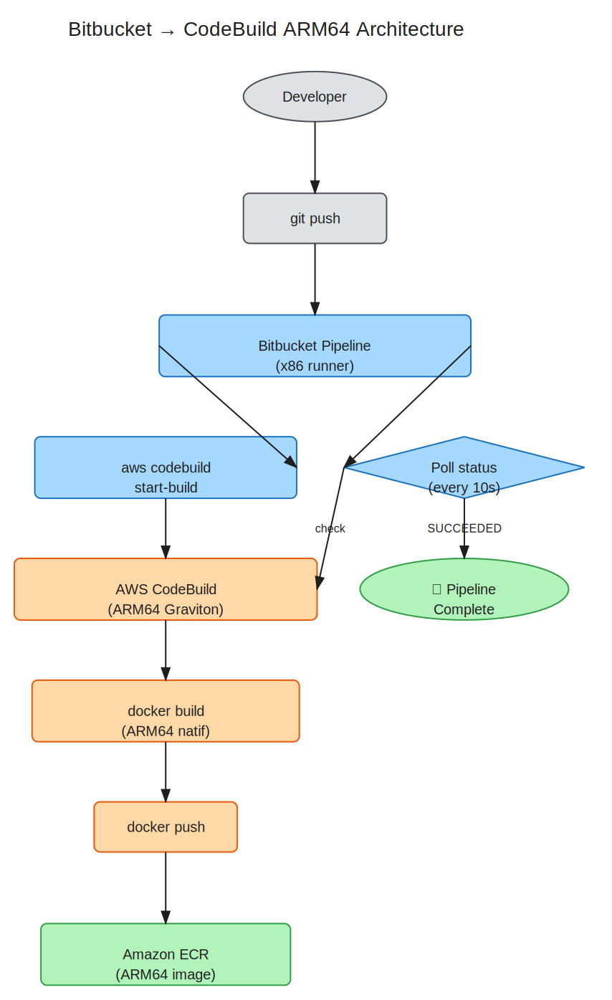
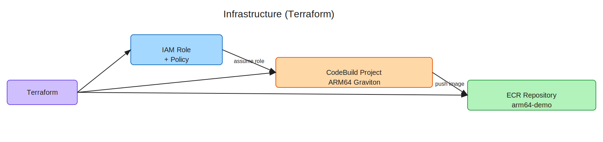

# Bitbucket → AWS CodeBuild ARM64 Image Builder

## Problem

Bitbucket Pipelines **does not offer ARM64 runners**. Building ARM64 Docker images via QEMU emulation is **~10x slower** than native builds. This project solves that by delegating the build to AWS CodeBuild running on **Graviton (ARM64 native)** instances.

## Architecture



### How It Works

1. **Developer** pushes code to Bitbucket
2. **Bitbucket Pipeline** (x86 runner) triggers AWS CodeBuild via `aws codebuild start-build`
3. **AWS CodeBuild** (Graviton ARM64) runs the Docker build natively — no emulation
4. **CodeBuild** pushes the ARM64 image to **Amazon ECR**
5. **Bitbucket Pipeline** polls CodeBuild status every 10 seconds until `SUCCEEDED`
6. Pipeline completes ✅

### Key Insight

The Bitbucket pipeline acts as an **orchestrator only** — it doesn't build anything. The actual compilation happens on AWS Graviton hardware, giving native ARM64 performance.

## Infrastructure



All infrastructure is managed with **Terraform** (`infra/codebuild.tf`):

| Resource | Purpose |
|----------|---------|
| **ECR Repository** (`arm64-demo`) | Stores the built ARM64 Docker images |
| **CodeBuild Project** (`arm64-image-builder`) | Runs builds on `ARM_CONTAINER` (Graviton) |
| **IAM Role + Policy** | Grants CodeBuild access to ECR push + CloudWatch logs |

### CodeBuild Configuration

- **Compute**: `BUILD_GENERAL1_SMALL` (ARM64)
- **Image**: `aws/codebuild/amazonlinux2-aarch64-standard:3.0`
- **Type**: `ARM_CONTAINER` → runs on Graviton instances
- **Privileged mode**: enabled (required for `docker build`)

## File Structure

```
.
├── README.md                  # This file
├── .env                       # Environment variables (account ID, region)
├── .gitignore                 # Excludes .env, Terraform state & cache
├── Dockerfile                 # ARM64 Python demo image
├── app.py                     # Simple hello world app
├── bitbucket-pipelines.yml    # Orchestrator: trigger CodeBuild + poll
├── buildspec.yml              # CodeBuild instructions: build + push ECR
├── docs/
│   ├── architecture.svg       # Pipeline flow diagram
│   └── infra.svg              # Infrastructure diagram
└── infra/
    ├── codebuild.tf           # Terraform: ECR + CodeBuild + IAM
    └── terraform.tfvars       # Variables (account ID)
```

## Quick Start

### 1. Configure

```bash
cp .env.example .env
# Edit with your AWS account ID and region
vi .env
vi infra/terraform.tfvars
```

### 2. Deploy Infrastructure

```bash
cd infra
terraform init
terraform apply -auto-approve
```

### 3. Configure Bitbucket

In **Repository Settings → Pipelines → Environment Variables**, add:

| Variable | Value |
|----------|-------|
| `AWS_ACCESS_KEY_ID` | IAM user with `codebuild:StartBuild` + `codebuild:BatchGetBuilds` |
| `AWS_SECRET_ACCESS_KEY` | Corresponding secret key |
| `AWS_DEFAULT_REGION` | e.g. `ca-central-1` |

### 4. Run

```bash
git push  # Pipeline triggers automatically
```

## Result

ARM64 image available in ECR:

```bash
# Pull and verify
docker pull <account>.dkr.ecr.<region>.amazonaws.com/arm64-demo:latest
docker inspect <image> | grep Architecture
# → "Architecture": "arm64"
```

## Why This Approach?

| Approach | Build Time | Cost | Complexity |
|----------|-----------|------|------------|
| QEMU emulation on Bitbucket | ~10 min | $$$ (runner time) | Low |
| **CodeBuild Graviton (this)** | **~1 min** | **$** (pay per build-minute) | Medium |
| Self-hosted ARM64 runner | ~1 min | $$$ (EC2 24/7) | High |

CodeBuild Graviton gives **native ARM64 speed** with **pay-per-use pricing** and **zero maintenance** of runner infrastructure.
